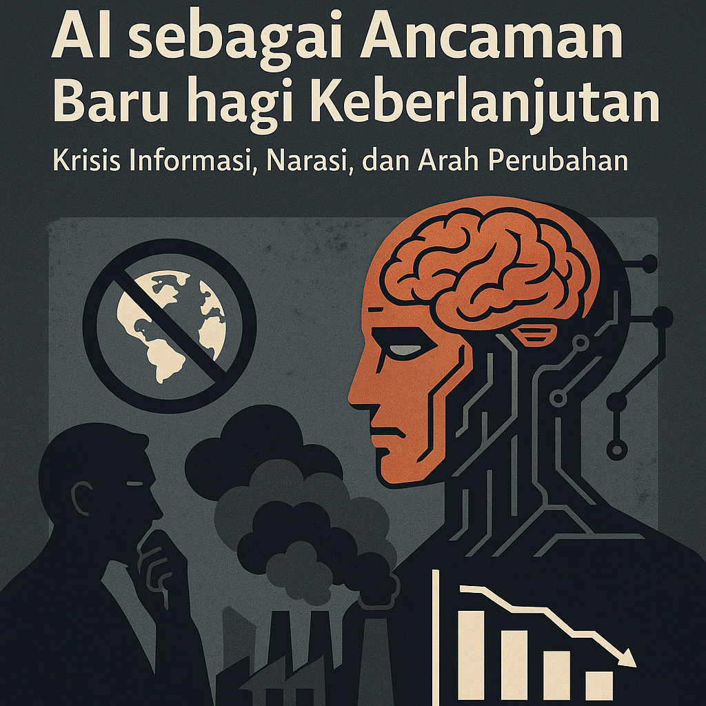
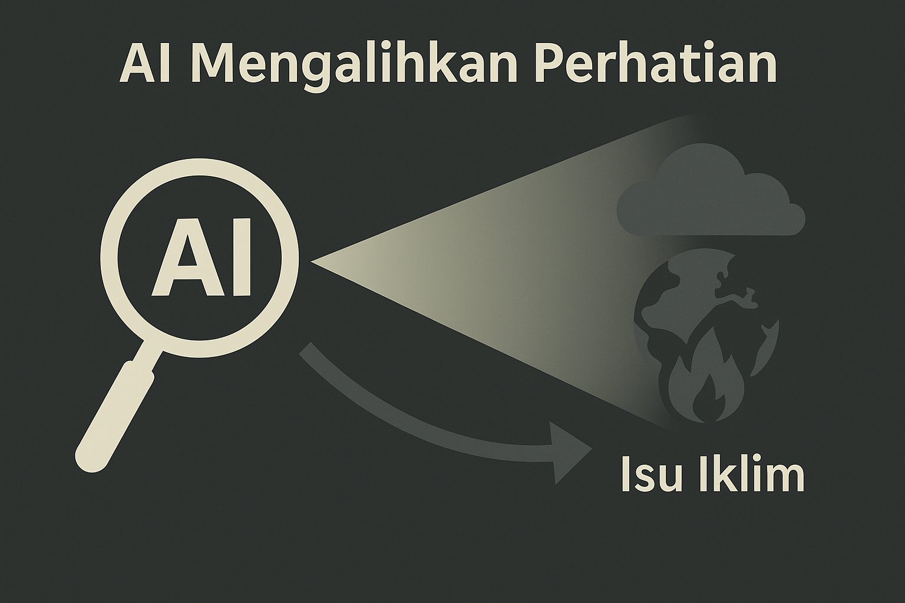
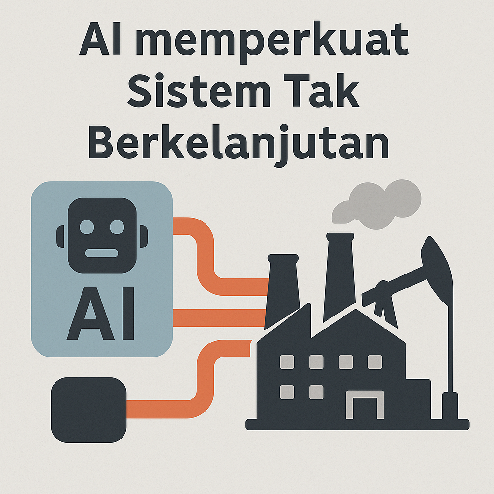

# UAS-1 My Concepts
AI sebagai Ancaman Baru bagi Keberlanjutan: Krisis Informasi, Narasi, dan Arah Perubahan

  

Perubahan iklim sering dibingkai sebagai masalah teknologi—seolah-olah inovasi yang lebih canggih otomatis akan membawa masyarakat menuju masa depan yang lebih hijau. Namun, setelah melihat perkembangan beberapa tahun terakhir, saya justru melihat pola yang mengkhawatirkan: alih-alih membantu, gelombang artificial intelligence justru mulai menghalangi upaya keberlanjutan. Bagi saya, ancaman yang dibawa AI bukan hanya soal jejak karbon data center, tetapi bagaimana AI menggeser perhatian, mengunci anggaran, dan memperkuat sistem ekonomi yang sebenarnya menjadi sumber krisis lingkungan itu sendiri.

Konsep utama saya sederhana: <strong>AI tidak netral</strong>. Cara ia berkembang sangat dipengaruhi oleh insentif bisnis dan narasi yang dibangun aktor-aktor dominan. Fenomena “AI hype” terbukti menyedot energi intelektual dan politik dari isu iklim. Ketika para eksekutif, pemerintah, dan investor menghabiskan waktunya mengejar FOMO teknologi, ruang untuk membahas risiko ekologis, transisi energi yang sulit, atau perubahan konsumsi menjadi semakin kecil. Pada akhirnya, perhatian manusia adalah sumber daya yang paling terbatas—dan saat AI menjadi pusat semua percakapan, isu iklim bergerak ke pinggir.

  

Masalahnya tidak berhenti pada perhatian. Alokasi anggaran perusahaan menunjukkan bahwa AI sudah berubah menjadi proyek raksasa yang memakan dana yang seharusnya bisa dialihkan untuk keberlanjutan. Ketika perusahaan-perusahaan besar rela menghabiskan 5%–10% pendapatan untuk adopsi AI yang belum tentu menghasilkan dampak nyata, kita melihat bahwa “keterbatasan dana untuk proyek hijau” selama ini lebih merupakan dalih daripada kenyataan. AI telah membongkar ilusi bahwa ROI adalah alasan utama perusahaan menunda aksi iklim; yang terjadi justru sebaliknya, dana mengalir deras karena AI dianggap “seksi”, sementara keberlanjutan kembali dianggap beban.

Di sisi lain, AI tidak hanya memonopoli perhatian dan anggaran—ia juga memperkuat struktur ekonomi yang tidak selaras dengan batas ekologis. Sebagian besar implementasi AI berfokus pada efisiensi: mempercepat produksi, mengoptimalkan konsumsi energi jangka pendek, atau memotong biaya operasional. Namun efisiensi bukanlah transformasi sistem. Ia hanya membuat mesin lama berputar lebih cepat. Dalam konteks krisis iklim, efisiensi justru dapat memperpanjang umur model bisnis yang tidak berkelanjutan, karena perusahaan merasa telah “berinovasi secara hijau”, meski sebenarnya tidak ada perubahan mendasar dalam cara mereka memanfaatkan energi, ruang, atau sumber daya alam.

Dalam konsep saya, ini adalah bentuk <strong>lock-in teknologi</strong>: ketika sebuah inovasi memperkuat jalan lama, bukan membuka jalan baru. AI, dalam bentuknya sekarang, memperkuat ekonomi yang dibangun atas pertumbuhan tanpa batas—padahal justru logika pertumbuhan inilah yang mendorong eksploitasi alam dan memicu instabilitas iklim. Bukannya menciptakan ruang untuk desain ulang sistem, AI justru memberi narasi nyaman bahwa “teknologi akan menyelamatkan kita”, sehingga menunda keputusan sulit tentang pengurangan konsumsi dan perubahan gaya hidup.

  

Maka dari itu, saya melihat dua upaya yang harus berjalan bersamaan. Pertama, <strong>menantang narasi</strong> yang menyamakan AI dengan solusi iklim. Kita perlu mengkritisi klaim-klaim teknosentris yang hanya menambah kabut optimisme palsu. Kedua, mengubah <strong>lingkungan tempat AI tumbuh</strong>—regulasi, norma publik, arah riset, dan insentif bisnis—agar teknologi tidak otomatis melayani kepentingan jangka pendek, tetapi diarahkan untuk mendukung planet yang berkelanjutan.

