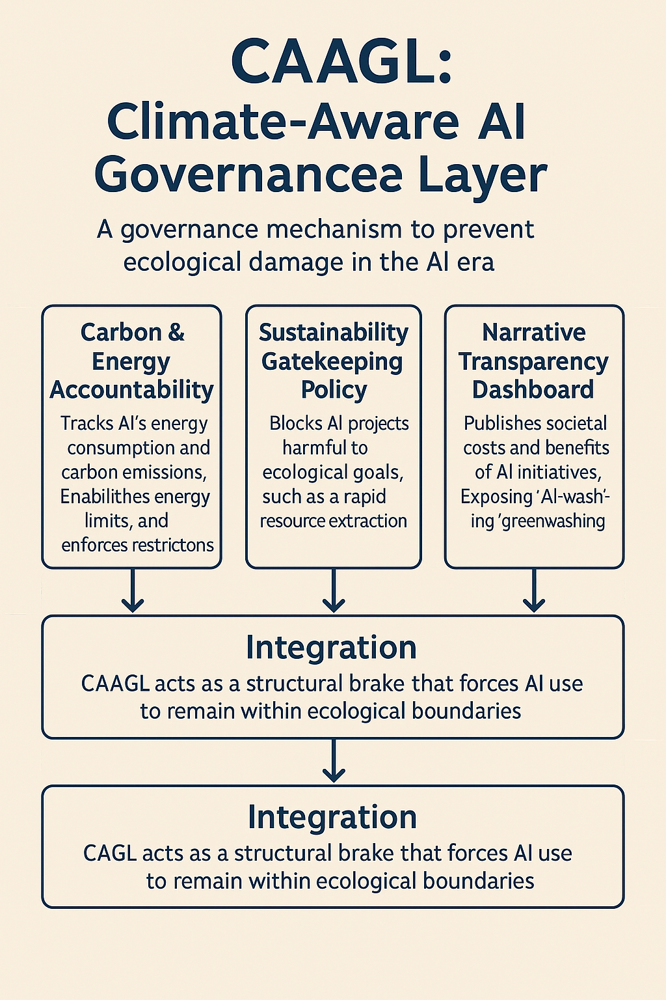

# UAS-3 My Innovations
CAAGL: Climate-Aware AI Governance Layer

Mengacu pada konsep dan opini sebelumnya, saya memandang bahwa masalah utama bukan terletak pada “kurangnya teknologi”, tetapi pada arah teknologi yang tidak dikendalikan oleh prinsip keberlanjutan. Karena itu, inovasi yang saya usulkan bukan berupa aplikasi AI baru, melainkan sebuah lapisan tata kelola (governance layer) yang mengontrol bagaimana AI dijalankan, dievaluasi, dan dibatasi agar tidak memperburuk krisis iklim. Saya menyebutnya <strong>Climate-Aware AI Governance Layer (CAAGL)</strong>.

  

CAAGL adalah arsitektur pengawasan yang ditempatkan di atas model-model AI yang digunakan dalam perusahaan, lembaga publik, maupun industri digital. Fungsi utamanya adalah memastikan bahwa setiap implementasi AI harus melalui tiga proses: <strong>penilaian dampak iklim</strong>, <strong>batas energi</strong>, dan <strong>kebijakan penggunaan</strong> yang mengutamakan keberlanjutan. Inovasi ini berangkat dari kritik yang saya sampaikan sebelumnya: AI saat ini tumbuh tanpa pagar pembatas, sehingga menciptakan insentif untuk mempercepat produksi, bukan mengurangi tekanan ekologis.

## I. Modul 1 – Carbon & Energy Accountability (CEA)

CEA adalah modul yang melacak konsumsi energi AI secara real-time. Setiap pelatihan model, inferensi, atau penggunaan pipeline AI otomatis dicatat, dihitung jejak karbonnya, dan diklasifikasikan ke dalam level risiko. Jika penggunaan melebihi batas energi yang ditetapkan, sistem akan memberikan rekomendasi pembatasan atau mengalihkan tugas ke model yang lebih ringan. Dengan ini, AI tidak lagi menjadi “alat efisiensi buta”, melainkan sistem yang harus mempertanggungjawabkan biaya ekologinya.

## II. Modul 2 – Sustainability Gatekeeping Policy (SGP)

SGP adalah mekanisme kebijakan yang memblokir proyek AI yang berpotensi memperkuat struktur ekonomi tidak berkelanjutan. Misalnya, AI untuk mempercepat ekstraksi sumber daya, optimasi industri intensif energi, atau strategi pemasaran yang mendorong konsumsi berlebihan. Sistem ini bekerja seperti “gatekeeper”: proyek AI hanya dapat dilanjutkan jika lulus uji manfaat bersih (net sustainability gain). Pendekatan ini memastikan bahwa AI tidak memperpanjang umur sistem lama yang merusak lingkungan.

## III. Modul 3 – Narrative Transparency Dashboard (NTD)

Masalah keberlanjutan tidak hanya teknis, tetapi juga naratif. Banyak organisasi menggunakan narasi “AI for climate” tanpa bukti konkret. NTD berfungsi sebagai dasbor yang menampilkan secara publik: konsumsi energi, dampak karbon, alokasi anggaran AI vs anggaran keberlanjutan, dan manfaat nyata terhadap penurunan emisi. Transparansi ini menciptakan tekanan sosial agar organisasi tidak melakukan <em>AI-washing</em>.

## IV. Integrasi: Lapisan Pengendali yang Selaras dengan Keberlanjutan

CAAGL bekerja sebagai “rem struktural” yang menahan laju penggunaan AI ketika dampaknya kontraproduktif bagi planet. Inovasi ini tidak menolak teknologi, tetapi menempatkannya dalam kerangka keberlanjutan yang ketat. Dengan cara ini, AI dapat dipaksa untuk beroperasi dalam batas-batas ekologis, bukan mengikuti logika pasar yang hanya mengejar efisiensi dan pertumbuhan.

Singkatnya, inovasi CAAGL mengisi celah kritis antara teknologi dan keberlanjutan—memindahkan diskusi dari “bagaimana AI mempercepat inovasi” menjadi “bagaimana AI tidak mempercepat kerusakan”. Di era ketika AI bisa menjadi ancaman struktural bagi iklim, lapisan tata kelola seperti ini bukan hanya penting, tetapi mendesak.

